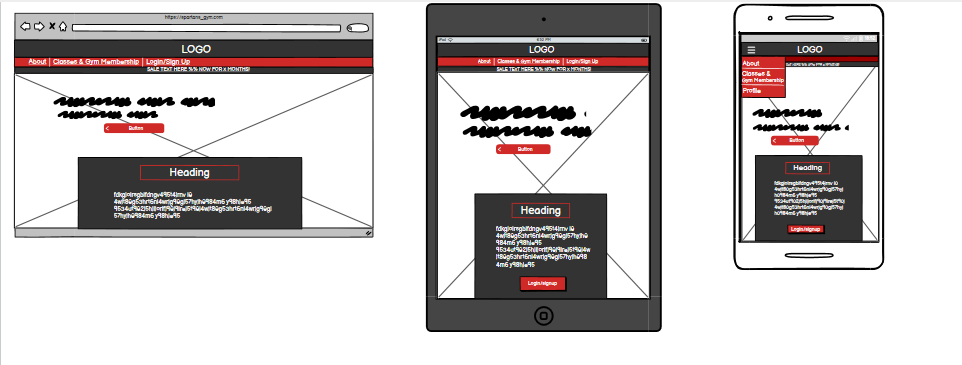
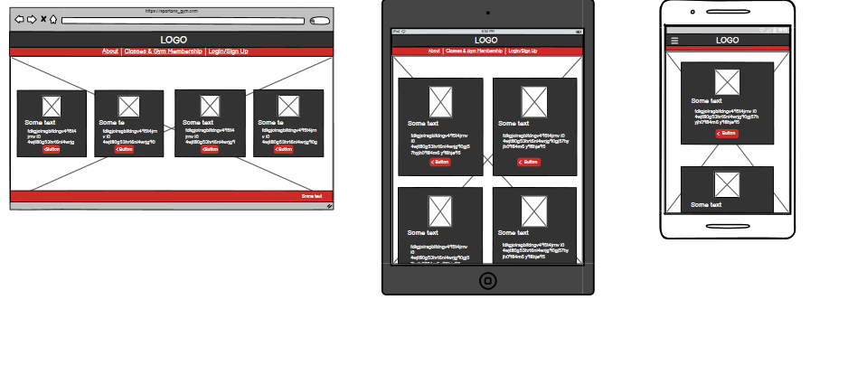
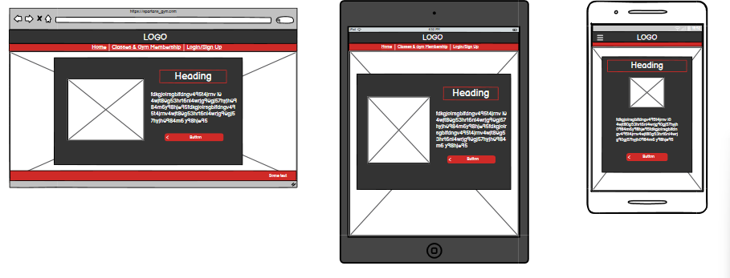
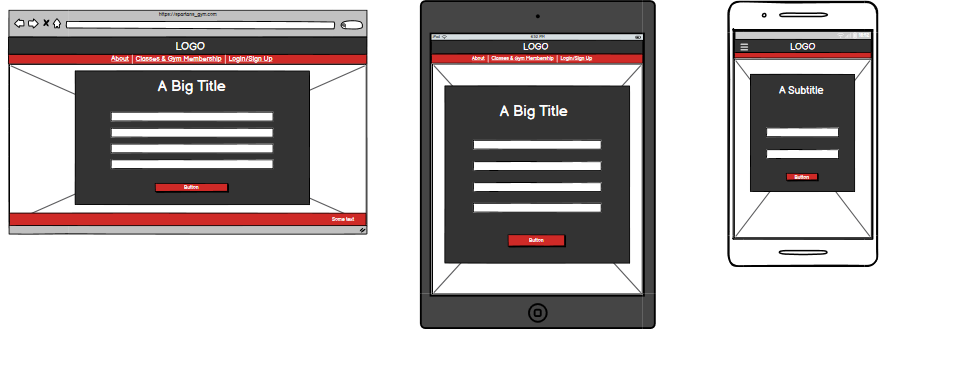
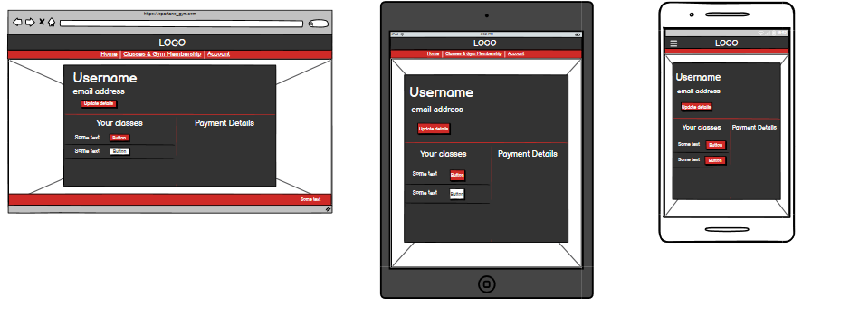
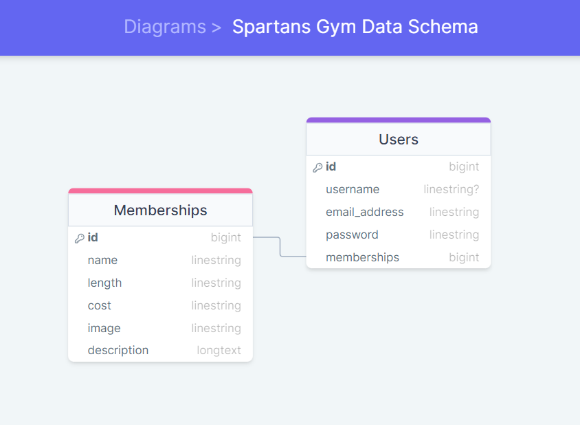
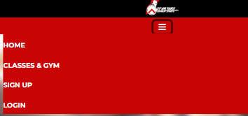
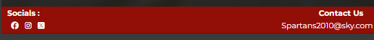

# Table of Content
1. [Site Overview](#site-overview)
2. [Planning](#planning)
    * [Target Audiences](#target-audiences)
    * [Color Scheme](#color-scheme)
    * [Wireframes](#wireframes)
    * [The Database](#the-database)
3. * [Features](#features)
    * [Existing Features](#existing-features)
    * [Future Updates](#future-updates)
4. [Testing](#testing)
    * [Responsiveness](#responsiveness-testing)
    * [Validator Results](#validator-results)
    * [Functionality](#functionality-testing)
    * [User Stories](#the-user-stories)
    * [Bug Report](#bug-report)
5. [Deployment](#deployment)
6. [Credits](#credits)

# Site Overview 

Welcome to Spartans Gym - your ultimate destination for fitness excellence. This full-stack website is meticulously crafted to provide both new and existing customers with unparalleled access to all of the gyms facilities, and an array of invigorating activities. With seamless account functionality, a secure payment system, and comprehensive listings of classes and offers, Spartans Gym promises a journey towards your fitness goals like never before. Join us and experience the epitome of fitness convenience and empowerment.

## Disclaimer:

This educational project has been developed with the intention of demonstrating proficiency in full-stack frameworks as part of a course curriculum. It is centered around a real-world location, serving as the subject matter of the website. It is important to note that explicit permission has been obtained from the respective business owner to utilize their establishment as the primary source of information and assets for this website.

# Planning 

## Target Audiences:

* Users looking to begin their fitness journey.

* Users already using the gym that have not used the site before.

* Users looking a convenient to update payment details.

* Users wanting to find out and potentially sign up to more classes.

* Users wanting a convenient way to cancel their membership.

### User Stories:

* As a someone who regularly uses the gym, I want to be able to find a cheaper way of having access to the gym without paying for a day at a time.

* As someone who does not exercise alot, I want to find out what facilities are available to me.

* As someone who trains in combat sports, I want to find a new gym to train at.

* As a gym user who is moving away, I want an easy way of cancelling my membership.

* As someone who does not enjoy weight training, I want to find a different way of working out.

## Color Scheme:

The colors I have chosen match with the real world gyms styling. Not only do I not see a reason to change it; As I will be using images of the gym itself I thought it made sense to keep the theme of the website as close to the interior of the gym as possible.

Below is a grind I have used to check the contrast scores so as to be sure all text remains readable throughout the site, created on hhttps://contrast-grid.eightshapes.com/ .

* The only color combinations used are those that pass.

## Wireframes:

Here are my wireframes that I created at the start of my project and used as the rough template for my site, for mobile, tablet and desktop viewing. 

* Home Page

* Membership page

* Membership details page

* Form pages

* Profile page 

## The Database:

My database ended up being very simplistic given how little data is required for the site. There are three Membership objects within created from the django model written in the required models.py file. Each of those objects contain the necessary data for the 3 options for classes/subscriptions. When a user selects and pays for one of the memberships, the currently logged in users object will grab the id from the chosen membership and place it into a list within the user object. By checking what numbers exist in said list, Django then knows what to display on the users Profile page. The project is currently in development at the time of writing this and any changes to this will be documented below. But for now this is the plan.

### The Data Schema:

# Features

Below you will find a list of the features currently found on the site.

## Existing Features:

### Navbar and Footer:

* Navbar

The site features a simple navbar as the point of navigation for users finding their way through the site. Built from the template found in bootstraps docs, the nav bar is fully responsive on all pages. On mobile and tablet screens, the text links on the navbar will be replaced by a toggle button which triggers a dropdown menu. The toggle icon is 3 horizontal lines to be consistent with current convention.

* Footer

Also consistent throughout the site is the footer. The footer is very basic and contains the gyms email address for contact, that users can copy. And links to social media sites (that will just take you to the home page of each respective app/site).

## Future Updates

# Testing

## Responsiveness Testing:

I began testing the responsiveness of the site firstly by switching through different device screen sizes using developer tools on google chrome on each page and using every feature at each main breakpoint. Below you will find a screenshot of the full list of the device screen sizes used.

* List of device screen-sizes used in dev tools:

### I have tried to test the website on as many devices as I can, however, I don't have access to many. here I will include a list of all the devices that I have been to use to test the site:
* ASUS Zenbook Duo 14 ^
* Samsung S20 ultra ^
* Samsung A51
* IPhone 14
* IPhone 12
* IPad Air (4th gen) ^

### Here is a list of the different browsers I have tested the website on and found no obvious faults:
* Opera/Opera GX
* Google Chrome
* Microsoft Edge
* Mozilla Firefox
* Samsung Internet (Android)
* Safari 

## Validator results

### HTML Validator

### CSS Validator Results:

## Functionality Testing:

## The User Stories:

## Bug Report:

# Deployment

* The site was deployed to Heroku. The steps to deploy are as follows:
    * From the overview page, navigate to deploy
    * Scroll right down to the bottom of the page until you see a purple 'deploy' button
    * Click this button and wait for Heroku to build the app
    * Assuming the build encounters no errors, You will see a 'view app' button both at the top and bottom of the page
    * Click this button and the browser will navigate to the deployed app.

The live link can be found here - 

# Credits