# Table of Content
1. [Site Overview](#site-overview)
2. [Planning](#planning)
    * [Target Audiences](#target-audiences)
    * [Color Scheme](#color-scheme)
    * [Wireframes](#wireframes)
    * [The Database](#the-database)
3. * [Features](#features)
    * [Navbar and Footer](#navbar-and-footer)
    * [Home Page](#home-page)
    * [Membership Pages](#membership-pages)
    * [Login and Sign Up Pages](#login-and-sign-up-pages)
    * [Profile Page](#profile-page)
    * [Future Updates](#future-updates)
4. [Testing](#testing)
    * [Responsiveness](#responsiveness-testing)
    * [Validator Results](#validator-results)
    * [Functionality](#functionality-testing)
    * [User Stories](#the-user-stories)
    * [Bug Report](#bug-report)
5. [Deployment](#deployment)
6. [Credits](#credits)

# Site Overview 

Welcome to Spartans Gym - your ultimate destination for fitness excellence. This full-stack website is meticulously crafted to provide both new and existing customers with unparalleled access to all of the gyms facilities, and an array of invigorating activities. With seamless account functionality, a secure payment system, and comprehensive listings of classes and offers, Spartans Gym promises a journey towards your fitness goals like never before. Join us and experience the epitome of fitness convenience and empowerment.

## Disclaimer:

This educational project has been developed with the intention of demonstrating proficiency in full-stack frameworks as part of a course curriculum. It is centered around a real-world location, serving as the subject matter of the website. It is important to note that explicit permission has been obtained from the respective business owner to utilize their establishment as the primary source of information and assets for this website.

# Planning 

## Target Audiences:

* Users looking to begin their fitness journey.

* Users already using the gym.

* Users wanting a simple and easy to understand UI.

* Users wanting additional information about the gym.

## Color Scheme:

The colors I have chosen match with the real world gyms styling. Not only do I not see a reason to change it; As I will be using images of the gym itself I thought it made sense to keep the theme of the website as close to the interior of the gym as possible.

Below is a grind I have used to check the contrast scores so as to be sure all text remains readable throughout the site, created on hhttps://contrast-grid.eightshapes.com/ .

* The only color combinations used are those that pass.

## Wireframes:

Here are my wireframes that I created at the start of my project and used as the rough template for my site, for mobile, tablet and desktop viewing. 

* Home Page

* Membership page

* Membership details page

* Form pages

* Profile page 

## The Database:

My database ended up being very simplistic given how little data is required for the site. There are three Membership objects within created from the django model written in the required models.py file. Each of those objects contain the necessary data for the 3 options for classes/subscriptions. When a user selects and pays for one of the memberships, the currently logged in users object will grab the id from the chosen membership and place it into a list within the user object. By checking what numbers exist in said list, Django then knows what to display on the users Profile page. The project is currently in development at the time of writing this and any changes to this will be documented below. But for now this is the plan.

* This project uses amazon aws services to store all static files used across the site.

### The Data Schema:

I have used drawsql to create this data schema. Due to the app being very strict on only using its pre set data types, and those on that list not correlating with what I believe to be the correct thing to put. Not all data types are accurate. However I have done my best to be as close as possible.

Since writing this section of my readme, I have added to my site and it's database. To meet my projects requirements I needed to provide the full CRUD functionality I was given to believe allauth would take care of. And so decided on a Newsletter. Details of this will be found below in the Features section. Here I will briefly explain its part in my site data schema. The mailist object takes two pieces of data. The user object is used allowing the email address used for the newsletter sign up to be independent from the users email, yet still associated to the user who created it. I have connected the user column to the id of the user object in this screenshot, as I could not attach to the whole table.

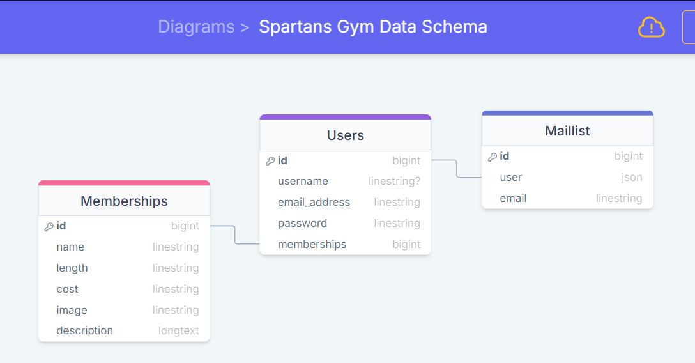

# Features

Below you will find a list of the features currently found on the site.

## Navbar and Footer:

### Navbar

The site features a simple navbar as the point of navigation for users finding their way through the site. Built from the template found in bootstraps docs, the nav bar is fully responsive on all pages. On mobile and tablet screens, the text links on the navbar will be replaced by a toggle button which triggers a dropdown menu. The toggle icon is 3 horizontal lines to be consistent with current convention.

### Footer

Also consistent throughout the site is the footer. The footer is very basic and contains the gyms email address for contact, that users can copy. And links to social media sites (that will just take you to the home page of each respective app/site).

## Home page:

As the landing page for the site, the home page is designed to grab the users attention and immediately invite them further into the site. It features a large heading and below a text box containing a short paragraph to inform the user of where they are as well as the sites purpose. Also in the text box is a button, with a colour and text meant to act as a call to action for the user to continue into the site.

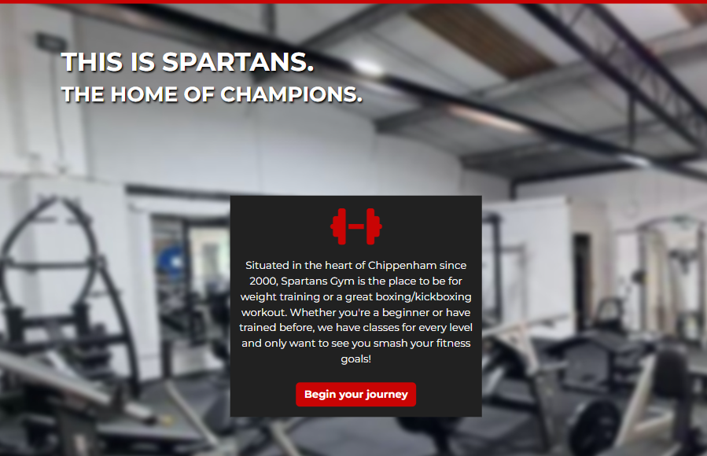

I've decided to also include in this section, The messages feature found on the site. Taking use of django's in-built messages framework and templating logic. The site will dynamically display messages to the user no matter what page/template they are currently on.

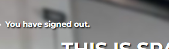

## Membership pages:

### Memberships page

The memberships page is very simplistic in its design. Using template logic, the page generates a card for each membership option the gym has available. Each card features The name/type of membership, an image correlating with the membership and a button with text reading "Learn more >" prompting the user to investigate further into the site.

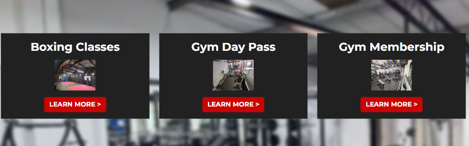

### Membership Details page

From the main membership page upon clicking the button on one of the cards, the user is brought to the membership details page for the membership they have chosen. They are gretted with an enlarged version of the image found on the membership page and details on the membership type itself. Aswell as the button acting as a portal to Stripe payments where the user can pay for, and confirm their subscription/membership.

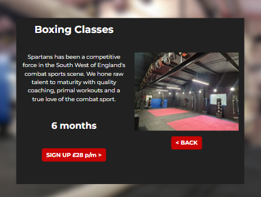

## Profile page: 

Once the user has signed up/ logged into their account, they are able to access the profile page. This page is broken into three sections detailed below.

### Profile Details

At the top of the page, the user is greeted with the heading "Your Profile". Informing them of where they are. And just below that, the details which they created their account with e.g: username and email. Aswell as a button with a text prompt, allowing the user to update their password. *SEE BUG REPORT*

### Newsletter 

After discovering allauth would not achieve the site requirement of allowing full CRUD functionality. I decided to create a Mail list/ newsletter feature. That will allow the user (once signed in) to sign up an email, which can be separate to the email used for account sign up, to a mail list to receive monthly updates on the gym. Unfortunately given time constraints I was not able to achieve the functionality to send monthly emails. However the user still has full CRUD functionality available to them with what is currently available.

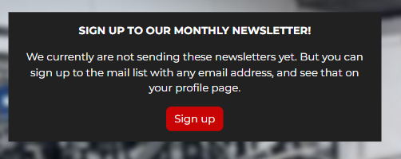

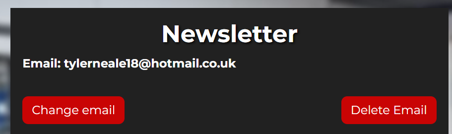

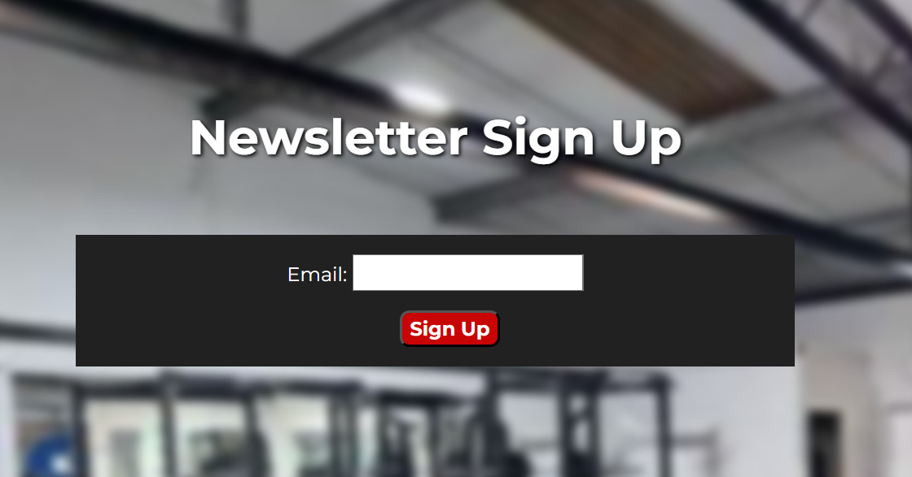

### Memberships 

At the bottom of the page, the user can find the "Your memberships" section. Which is a simple box containing a list of the subscriptions they are currently subscribed to if any. (This section will not appear if the user has not subscribed to any memberships)

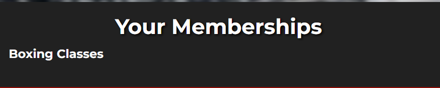

## Login / Sign up pages:

Given that both the sign up and login forms are virtually identical, bar the number of inputs. I have just put them together for this section. The styling remains uniform with the rest of the site. And below the input fields you can find buttons to submit the form and go back to the previous page. And below that a link to either the sign up or login page, depending on which one you are currently on.

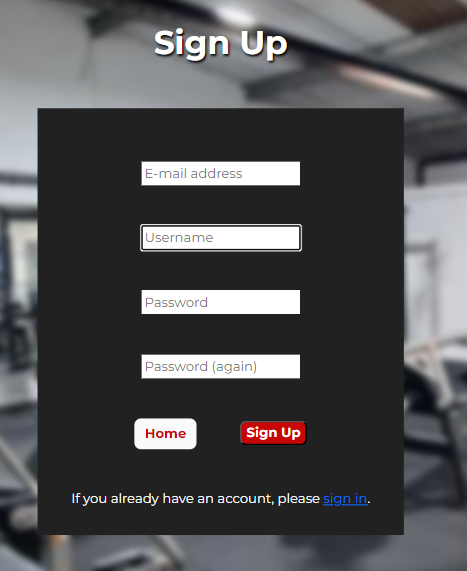

* Login page only contains field for username or email, and single password input.

When the user wishes to logout of their account for whatever reason. They can navigate to the link found in the navbar. Upon using that link, They are brought to this page to confirm that they wish to logout, or cancel the request. Once confirming they wish to logout. The user is brought back to the home page, with a message to confirm they have successfully been logged out displayed, as well as the change reflected in the nav bar.

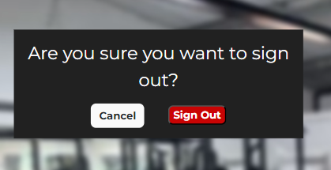

## Future Updates

* The main plan for the future of the site would be to complete the newsletter functionality, allowing emails to be sent to the user to confirm their subscription to the newsletter has been successful. And the continue to send emails on a monthly basis.

* A small thing I have elected to move over at this point given the short deadline I have to complete the project, Is the styling for the messages section. I have made sure it is visible to the user and somewhat uniform with the rest of the sites styling. However I did want to make it look a bit neater, but struggled deciding on a design that looked good, and how to implement it. 

# Testing

## Responsiveness Testing:

I began testing the responsiveness of the site firstly by switching through different device screen sizes using developer tools on google chrome on each page and using every feature at each main breakpoint. Below you will find a screenshot of the full list of the device screen sizes used.

* List of device screen-sizes used in dev tools:
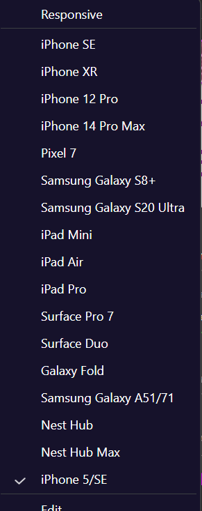

### I have tried to test the website on as many devices as I can, however, I don't have access to many. here I will include a list of all the devices that I have been to use to test the site:
* ASUS Zenbook Duo 14 ^
* Samsung S20 ultra ^
* IPhone 14

### Here is a list of the different browsers I have tested the website on and found no obvious faults:
* Opera/Opera GX
* Google Chrome
* Microsoft Edge
* Mozilla Firefox
* Samsung Internet (Android)
* Safari 

## Validator results

### HTML Validator

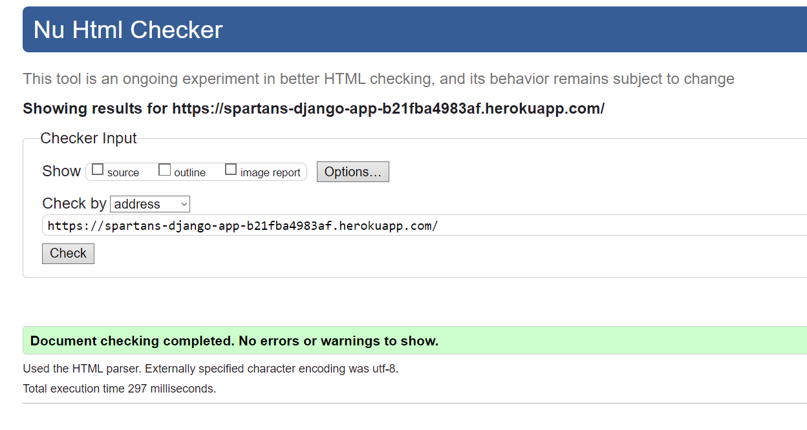

### CSS Validator Results:

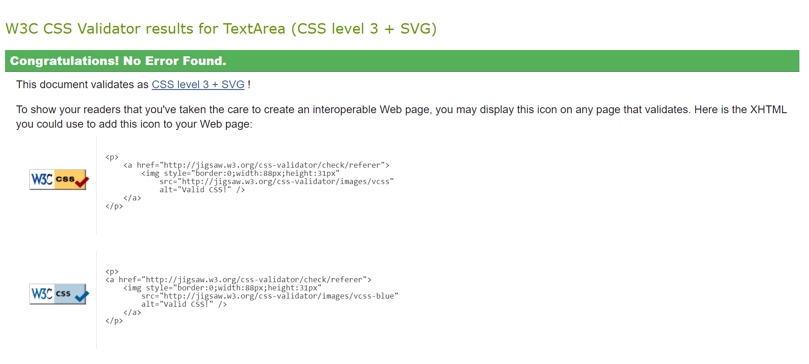

## Functionality Testing:

## The User Stories:

* Users looking to begin their fitness journey.
    * When landing on the home page, the user is presented with a button with the text "Begin your journey". Upon clicking this button the user is taken to the sign up page, and prompted to create an account. Once the user has signed up they are then able to sign up for a membership.

* Users already using the gym.
    * Users that have been going to the gym before this website was created, can now sign up to an account. Once the user is on the on the profile page, they can sign up for newsletters about current events and changes at the gym. Aswell as now being able to sign up to / renew their memberships.

* Users wanting a simple and easy to understand UI.
    * With so many over complex, and tricky to understand fitness websites and apps available to the user. This project places importance in keeping everything as streamlined and simple as possible. Upon landing on the site, the user is immediately greeted with the navigation menu and information about the gym. From there they are able to navigate around the site with clear labels/text on all buttons and links.

* Users wanting additional information about the gym.
    * Once a user has signed up to an account and navigated to their profile page. They are able to sign up to a monthly newsletter, containing news and general information about the gym.

## Bug Report:

* The custom background images do not fill the entire screen on some devices. This is due to having set sizes based off of average screen sizes, and also using a div to separate the footer from main content on pages with less content. Which then causes the footer to go beyond the bottom of the image. This is something I have done my best to correct this problem with custom css margins at the top and bottom of most pages. However certain devices of unusual sizes will have broken styling. The main culprits I have identified are the IPad pro, Which has a very wide screen in portrait, causing it to display as it would on a desktop. 

* Due to the outdated course material as well as the code along project not working correctly, I have used a different version of stripe payments than is used in the course. It has made achieving a working payment system incredibly easy. However, getting the required functionality (i.e: A message to display to the user and having the membership show up in the user object) has been much more difficult this way. The bug here is that to redirect back to my site after completing payment, currently opens the site in the same window as the payment screen. This is something I am hopeful to resolve but given time constraints I doubt I will.

* When attempting to use the functionality to change the password on the users account, found in the allauth package. I encountered an error where none of the change password templates allauth has available would render correctly. This seems to be coming from a filter named 'crispy' that is apparently not known to the template when it is included. and subsequently required when it is removed. I have run out of time to continue investigating this error and have instead found another way of giving the user full CRUD functionality.

# Deployment

* The site was deployed to Heroku. The steps to deploy are as follows:
    * From the overview page, navigate to deploy
    * Scroll right down to the bottom of the page until you see a purple 'deploy' button
    * Click this button and wait for Heroku to build the app
    * Assuming the build encounters no errors, You will see a 'view app' button both at the top and bottom of the page
    * Click this button and the browser will navigate to the deployed app.

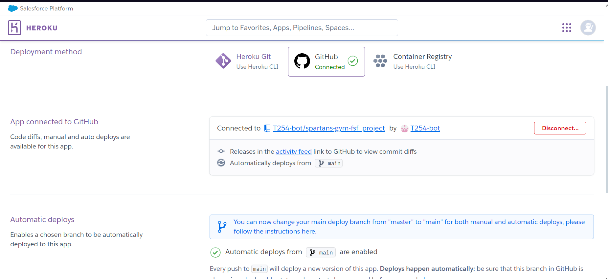
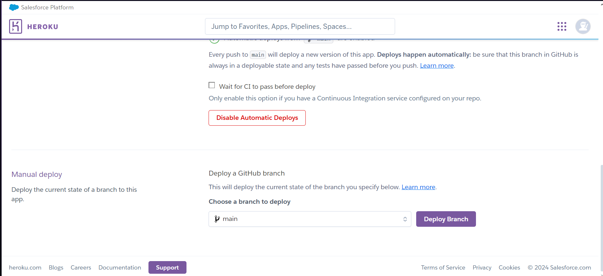
The live link can be found here - https://spartans-django-app-b21fba4983af.herokuapp.com

# Credits

* Richard Wells - Mentor  
Has gone above with the help he has provided me throughout this whole course and especially with this project.

* Barnaby Norman - Friend/Mentor
Barnaby is a family friend who works in the industry. He has been a pillar of support for the majority of this course. Sacrificing hours of his time to sit on call with me and assist with coding. As well as conducting research himself and finding the useful information I needed, in the mess of forums and docs.

* Spartans Gym - Real world inspiration
Finally a massive thank you to Spartans Gym. For not only allowing me to use their company and facility as the basis for my site. But also providing me with assets such as images and information to use as content.